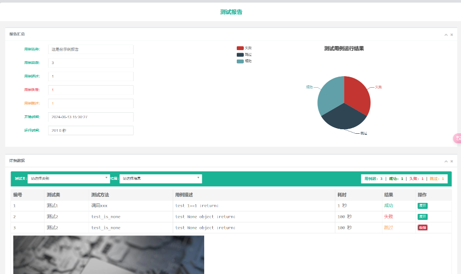

# 简介

1. 快速将dict内容转成报告，从而解决写入Excel写入困难，展示困难问题；


# 用法

每次写入必须按照固定键值对。
```python


from PIL import Image
from sindre.report import Report

data1 = {
    "className": "测试1",
    "methodName": "调用xxx",
    "description": "\n            test 1==1\n        :return:\n        ",
    "spendTime": 1.0,
    "status": "成功",
    "log": [

        "这是文本"
    ]
}

data2 = {
    "className": "测试2",
    "methodName": "test_is_none",
    "description": "\n            test None object\n        :return:\n        ",
    "spendTime": 100.0,
    "status": "失败",
    "log": [
        "",
        ""
    ]
}

data3 = {
    "className": "测试2",
    "methodName": "test_is_none",
    "description": "\n            test None object\n        :return:\n        ",
    "spendTime": 100.0,
    "status": "跳过",
    "log": []
}

if __name__ == '__main__':
    t = Report()
    # 更改用例名称
    t.data["testName"] = "这是份示例报告"
    # 从PIL加载图片到网页
    image = Image.open('./AI.png')
    print(image)
    b64_str = t.PIL_To_B64(image)
    data3["log"].append(b64_str)
    data3["log"].append("这是文本加图片")
    data3["log"].append("<a href='./AI.png' download>下载资源文件</a>")
    # 添加到网页中
    t.append_row(data1)
    t.append_row(data2)
    t.append_row(data3)
    # 写入到指定位置
    t.write(path="./")


```


# 结果

